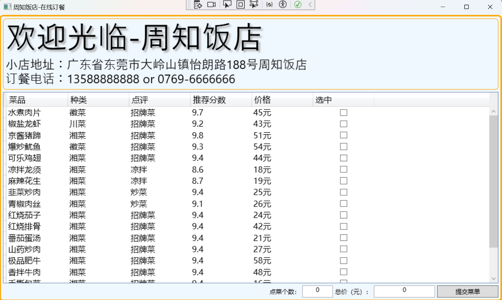
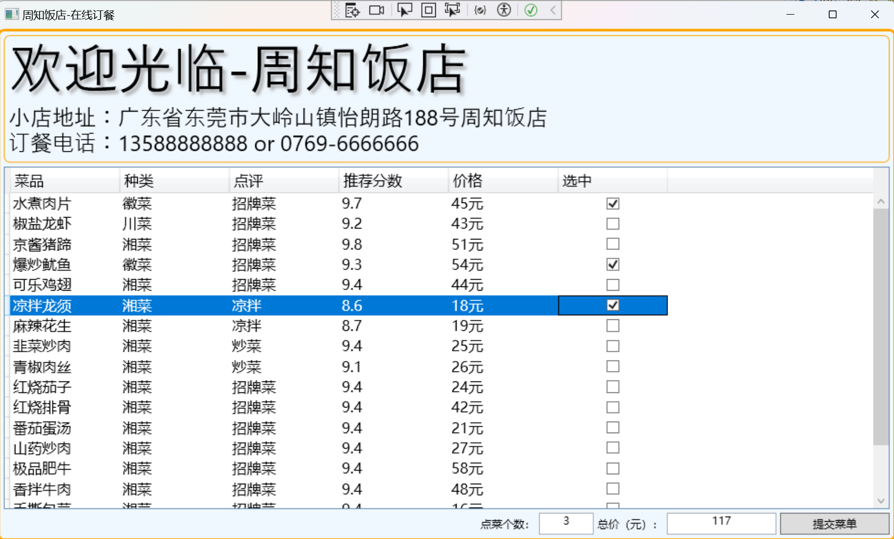
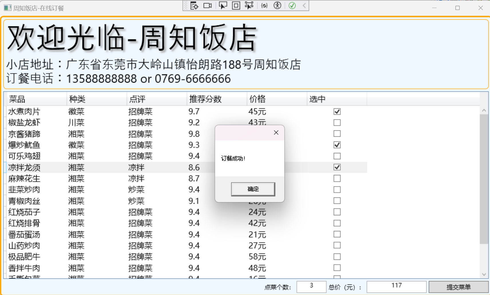

## 使用WPF实现的饭店点单程序

##### 项目采用了MVVM Light框架，使得代码结果清晰易读，降低代码耦合。

题外话：为啥项目菜单取名为周知饭店捏？因为我和朋友确实去过这家饭店，味道很不错，都是家常菜，所以就定为它吧。

开发环境：VS2022, net Framwork4.8, Windows11，Typora
打开运行前，需要添加管理NuGet程序包：MVVM Light

运行示意图：

欢迎各位大佬提问、Star。
